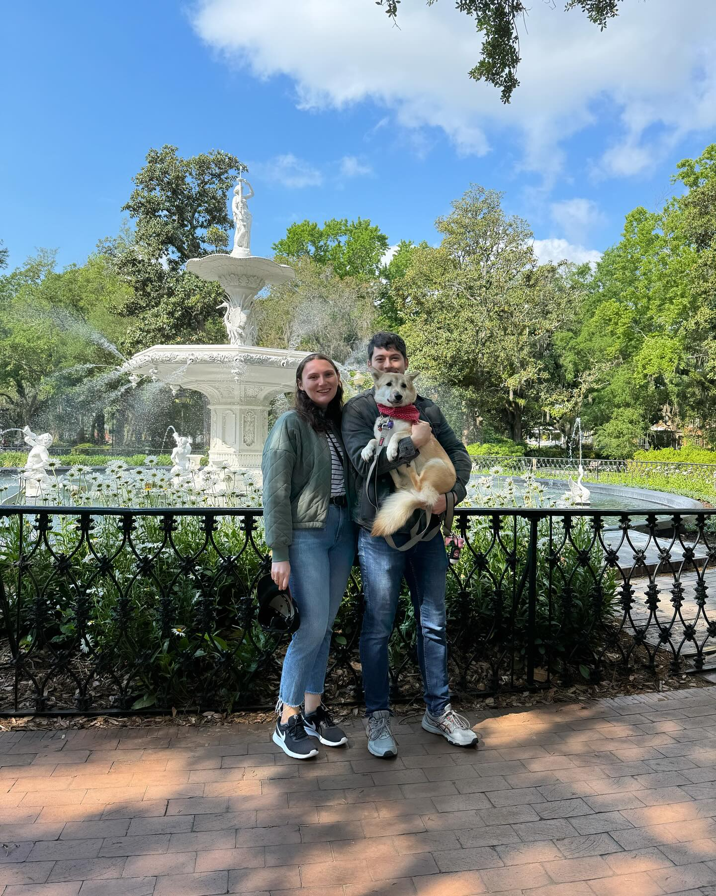

Hi, I'm Katherine Ryan, an urban planner living in New York.

In May 2023, I completed my Master's in Urban Planning at Hunter College.

```{r Hunter_Map[0], echo=FALSE, message=FALSE, warning=FALSE}
#| echo: false
#| message: false
#| warning: false

if(!require("leaflet")){
  options(repos=c(CRAN="https://cloud.r-project.org"))
  install.packages("leaflet")
  stopifnot(require("leaflet"))
}

hunter_longitude <- -73.9645
hunter_latitude  <- +40.7678

leaflet() |>
  addTiles() |>
  setView(hunter_longitude, hunter_latitude, zoom=17) |>
  addPopups(hunter_longitude, hunter_latitude, 
            "I am a former Master's student at <b>Hunter College</b>!")
```

My education started at SUNY Albany where I received a BA in Political Science in 2018. I then worked at the Nassau County Board of Elections for several years before coming to Greater Jamaica.

```{r DuoLingo_Streak_Function[1], echo=FALSE, message=FALSE, warning=FALSE}
library(httr2)
library(jsonlite)

fetch_duo_streak <- function(username) {
  req <- request("https://www.duolingo.com/2017-06-30/users") |>
    req_url_query(username = username,
                  fields = "streak,streakData{currentStreak,previousStreak}}")
  
  resp <- req_perform(req)
  user <- resp_body_json(resp)$users[[1]]
  
  streak_len <- function(x) if (is.list(x) && !is.null(x$length)) as.integer(x$length) else 0L
  candidates <- c(as.integer(user$streak %||% 0L),
                  streak_len(user$streakData$currentStreak),
                  streak_len(user$streakData$previousStreak))
  max(candidates, na.rm = TRUE)
}

'%||%' <- function(x, y) if (is.null(x)) y else x

USERNAME <- "KATIE196688"
STREAK <- fetch_duo_streak(USERNAME)
STREAKF <- formatC(STREAK, format = "f", big.mark = ",", digits = 0)
```

On a more personal level, I love travelling and languages.

```{r DuoLingo_Streak_Call[1], echo=FALSE, message=TRUE, warning=FALSE}
cat(sprintf("My current DuoLingo streak is %s days!\n", STREAKF))
```

<div class="center-image" style="text-align: center;">
